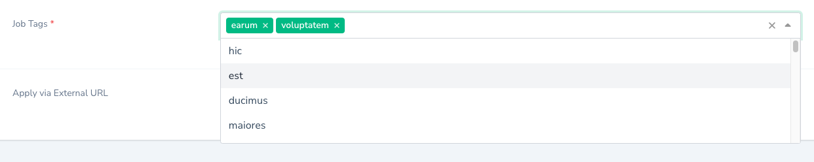

# Belongs To Many Field For Laraver Nova 4

Belongs To Many Field to represent many to many relationship in field.

## Installation
You can require this package using composer:

```composer require trinity-rank/belongs-to-many-field```

## Usage
In the nova resource you need to pass:

- Method make ('label', 'many to many relationship function name', 'Nova Resource Relationship')

```php

use TrinityRank\BelongsToManyField\BelongsToManyField;

public function fields(Request $request){
    return [
        BelongsToManyField::make('Job Tags','tags','App\Nova\Jobs\Tag'),
    ];
}
```


